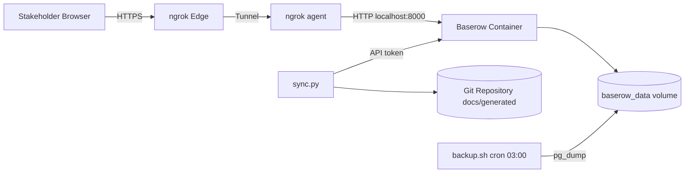
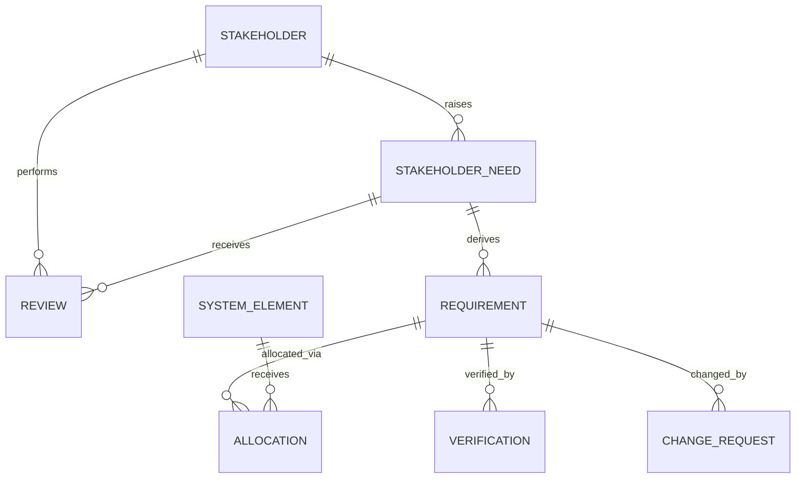
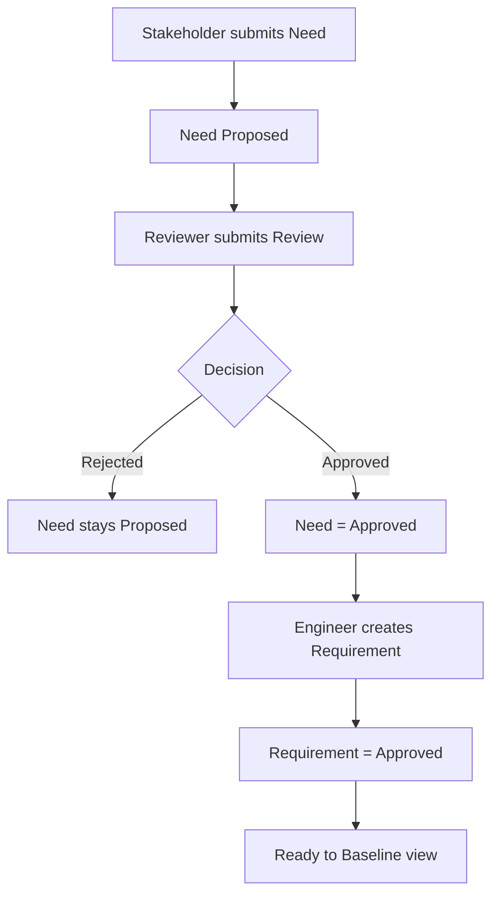
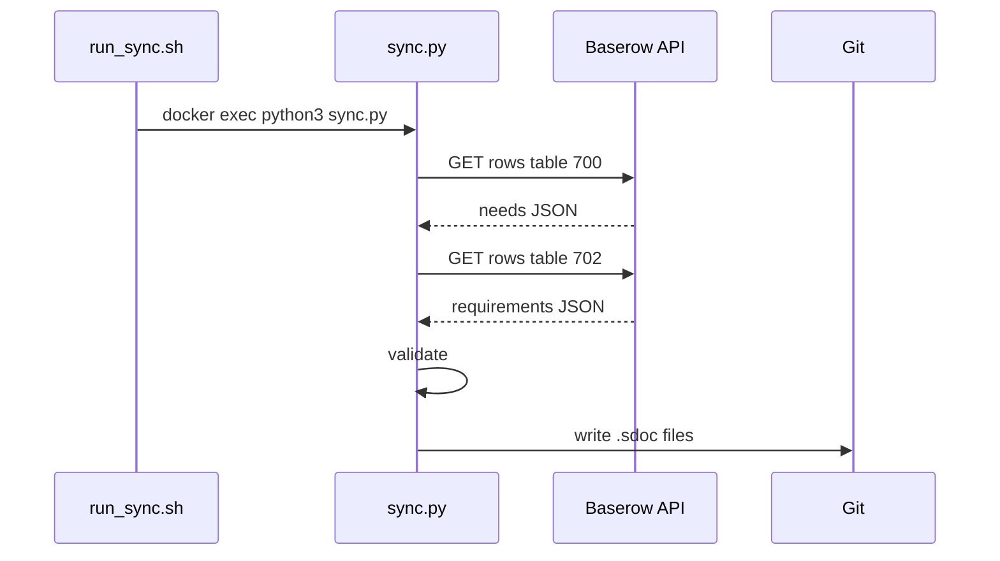
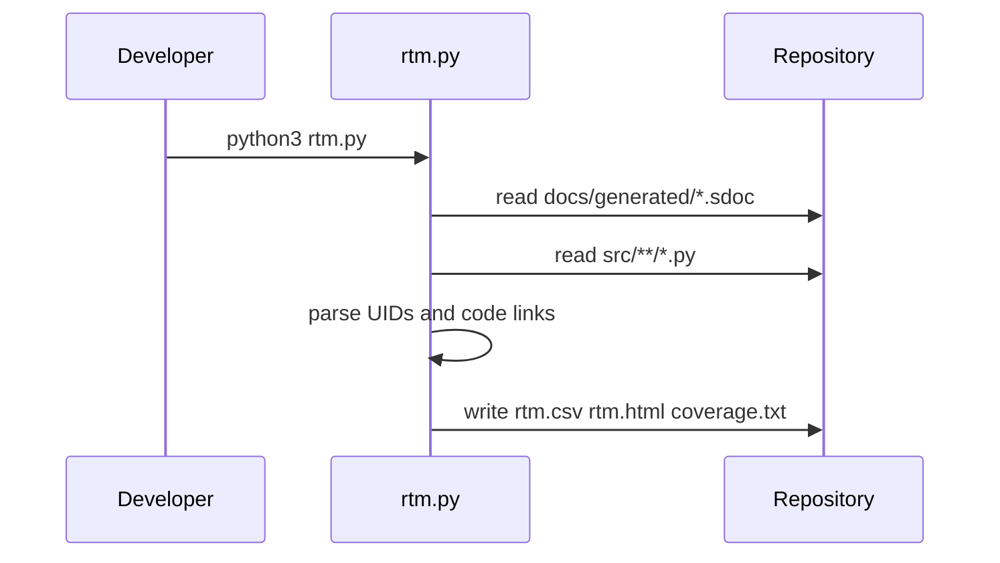
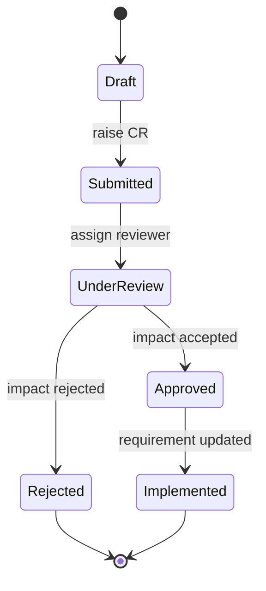

# Requirements Engineering Pipeline — Submission

**Student:** Aline ASIMWE
**Date:** 2026-09-25

## Links

- **Baserow instance (public HTTPS):** https://gizmo-vanquish-swinging.ngrok-free.dev
- **Git repository:** https://github.com/aline-001/requirements-pipeline (branch main).
- **RTM:** `rtm.html` in the repository root (renders in any browser).

## Task 1 — Normalized Requirements Database

### Tables

| # | Table | Key Fields | Links |
|---|-------|------------|-------|
| 1 | Stakeholder | Name, Role, Organisation, Contact | — |
| 2 | SystemElement | Name, Type, Description | — |
| 3 | StakeholderNeed | Title, Statement, Priority, Rationale, Status, Source | Stakeholder |
| 4 | Review | Review Title, Decision, Comments, Reviewed At | Reviewer (Stakeholder), Need (StakeholderNeed) |
| 5 | Requirement | Req ID, Statement, Type, Status | Need (StakeholderNeed) |
| 6 | Allocation | Allocation, Notes | Requirement, Element (SystemElement) |
| 7 | Verification | Verification ID, Method, Acceptance Criteria, Result, Verified At | Requirement |
| 8 | ChangeRequest | Title, Description, Status, Impact, Raised At | Requirement |

### Justification

- **Stakeholder** — Each person or group who raises needs, stored once, referenced by ID.
- **SystemElement** — Subsystems, components, and interfaces so requirements can be allocated without retyping.
- **StakeholderNeed** — What stakeholders want, separate from technical requirements. Holds priority, rationale, status.
- **Review** — Approval decisions. A need is Approved when an Approved review exists and no Rejected review exists.
- **Requirement** — The precise, testable version of a need. Status determines whether it syncs to Git.
- **Allocation** — Bridge table linking requirements to system elements. Many-to-many relationship.
- **Verification** — Records how each requirement was verified. Feeds coverage and pass-rate reports.
- **ChangeRequest** — Enforces the rule that a baselined requirement changes only through an approved CR.

### Views

- Element Responsibility (Allocation, grouped by Requirement)
- Requirements by Element (Allocation, grouped by Element)
- Needs Without Approved Review (StakeholderNeed, filtered where Review Decisions does not contain Approved)
- Unverified Requirements (Requirement, filtered where Verification is empty)

### ERD

See docs/task1.md for the full Mermaid ERD source.

### Test Data

Three stakeholders, three system elements, four needs, two reviews, three requirements, three allocations, three verifications, two change requests.

## Task 2 — Stakeholder Intake Forms

- **Submit a Need** form built in Baserow; every new need starts as Proposed.
- **Review a Need** form; reviewers approve or reject.
- Three additional forms described: Register Stakeholder, Request a Change, Record Verification.

### Approval Rule

A StakeholderNeed is Approved when at least one Review has Decision = Approved and no Review has Decision = Rejected.

### Ready to Baseline View

A Grid view on Requirement, filtered where Status = Approved.

### Form Flow

Form submission -> Proposed need -> Review form -> Approved decision -> Requirement created -> Ready to Baseline view -> sync to Git.

## Task 3 — Baserow on the Internet

### Deployment Method

Cloudflare Tunnel. Reason: no DNS or TLS setup needed, no inbound firewall ports, HTTPS provided automatically.

### Public URL

Quick tunnel: https://gizmo-vanquish-swinging.ngrok-free.dev (changes on restart).

A named tunnel (baserow.aline.darho.net) was configured and connected successfully — logs show "Registered tunnel connection ... protocol=http2" — but public-hostname routing could not be finalized from the available Cloudflare dashboard account.

### Networking Note

WSL's default network blocks outbound UDP port 7844 (QUIC), so all cloudflared invocations use --protocol http2 (TCP 443 fallback). Documented in cloudflared pre-checks.

### Security

- HTTPS only (Cloudflare edge)
- Public sign-up disabled in Baserow admin
- Separate API token (sync-script) scoped to the Requirements Engineering workspace

### Backup and Restore

backup.sh runs pg_dump inside the container, writes timestamped SQL to backups/, prunes to last 7. Scheduled daily at 03:00. Restore tested by piping a backup into a fresh baserow_restore_test database and confirming tables with psql.

### Deployment Diagram

## Task 4 — Sync to StrictDoc

### Sync Script

sync/sync.py + wrapper run_sync.sh. Pulls Approved/Baselined requirements from the Baserow API, writes one .sdoc file per need.

Because of the WSL networking issue (host cannot reach the container's mapped port 8000), the script is executed inside the container via docker exec.

### Error Handling

- Missing Req ID: warned and skipped
- Duplicate Req ID: fatal
- Requirement with no need: fatal
- Requirement links to missing need: fatal

### Manual and Scheduled Run

Manual: ./run_sync.sh. Scheduled: crontab entry at 03:15 daily.

### .sdoc Output

Files written to docs/generated/need_N.sdoc, with requirements nested under their parent need via StrictDoc RELATIONS blocks.

## Task 5 — Traceability, Verification and RTM

### @relation Tags

Three functions tagged in src/auth.py: login (REQ-001), enforce_session_timeout (REQ-002), reset_password (REQ-001, REQ-003).

### RTM

Generated by rtm.py from .sdoc files + source code. One row per requirement. Columns: UID, Title, Statement, Status, Parent Need, Allocations, Verifications, Code Link.

### Coverage Report

Total stakeholder needs: 4
Total requirements: 3
Requirements with no parent need: 0
Requirements with no code link: 0
Requirements with no status: 0
Pass rate (Approved or Baselined): 3/3 = 100.0%

### Published RTM

rtm.html renders in any browser.

## Task 6 — Change Requests

### State Diagram

Draft -> Submitted -> Under Review -> Approved -> Implemented (Rejected as terminal alternative).

### Impact Assessment

See docs/task6.md — full assessment for CR "Add SSO support to login".

### End-to-End

Baserow (CR created and Approved) -> sync (.sdoc regenerated) -> Git (commit) -> RTM (recomputed). See docs/task6.md.

## README — Reusing the Pipeline on a New Project

1. Clone this repository.
2. Copy .env.example to .env and fill in:
   - BASEROW_URL (e.g. http://localhost:8000)
   - BASEROW_TOKEN (created in Baserow Settings, Database tokens)
   - NEEDS_TABLE_ID and REQS_TABLE_ID (visible in each table URL)
3. Start Baserow: docker compose up -d
4. In Baserow, create the eight tables described in docs/task1.md, including link fields.
5. Run ./run_sync.sh to pull Approved requirements into docs/generated/.
6. Run python3 rtm.py to build rtm.csv, rtm.html, and coverage.txt.
7. Serve rtm.html: python3 -m http.server 9000 and open http://localhost:9000/rtm.html.
8. Optional: schedule backup.sh (daily 03:00) and run_sync.sh (daily 03:15) via crontab.

## Notes

- Baserow's API returns internal field_XXXX names; the sync script maps them back to human names.
- The RTM and coverage report are computed, never typed.
- Obsolete requirement IDs are never reused: when a requirement is removed, its ID stays Obsolete and a new ID is issued for the replacement.

---

## Appendix — All Mermaid Diagrams

### Task 1 — Entity Relationship Diagram

### Task 2 — Form to Approved Requirement

### Task 4 — Sync Sequence

### Task 5 — RTM Generation

### Task 6 — Change Request State Diagram

