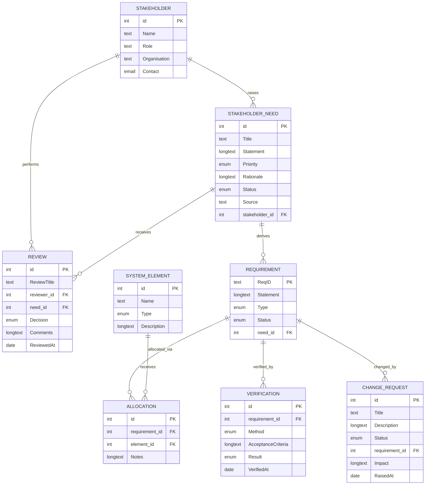

# Task 1 — Normalized Requirements Database

## Table List

| # | Table | Fields | Field Types | Links |
|---|-------|--------|-------------|-------|
| 1 | **Stakeholder** | Name, Role, Organisation, Contact | Text, Text, Text, Email | — |
| 2 | **SystemElement** | Name, Type, Description | Text, Single Select (Subsystem/Component/Interface), Long Text | — |
| 3 | **StakeholderNeed** | Title, Statement, Priority, Rationale, Status, Source, Stakeholder | Text, Long Text, Single Select (Must/Should/Could/Wont), Long Text, Single Select (Proposed/Approved/Rejected), Text, Link | **Stakeholder** → Stakeholder |
| 4 | **Review** | Review Title, Reviewer, Need, Decision, Comments, Reviewed At | Text, Link, Link, Single Select (Approved/Rejected/Needs Work), Long Text, Date | **Reviewer** → Stakeholder; **Need** → StakeholderNeed |
| 5 | **Requirement** | Req ID, Statement, Type, Status, Need | Text (unique), Long Text, Single Select (Functional/Non-Functional), Single Select (Draft/Approved/Baselined/Obsolete), Link | **Need** → StakeholderNeed |
| 6 | **Allocation** | Allocation, Requirement, Element, Notes | Text, Link, Link, Long Text | **Requirement** → Requirement; **Element** → SystemElement |
| 7 | **Verification** | Verification ID, Requirement, Method, Acceptance Criteria, Result, Verified At | Text, Link, Single Select (Test/Analysis/Inspection/Demo), Long Text, Single Select (Pass/Fail/Pending), Date | **Requirement** → Requirement |
| 8 | **ChangeRequest** | Title, Description, Status, Requirement, Impact, Raised At | Text, Long Text, Single Select (Draft/Submitted/Under Review/Approved/Rejected/Implemented), Link, Long Text, Date | **Requirement** → Requirement |

---

## Justification for Each Table

**Stakeholder** — Stores each person or group who raises needs, once, so their name, role, and contact details are never retyped in other tables. Every other table that mentions a stakeholder links here.

**SystemElement** — Defines the parts of the system (subsystems, components, interfaces) so requirements can be allocated to them without retyping element names. Enables "which requirements are implemented by this element?" queries.

**StakeholderNeed** — Records what stakeholders actually want, separate from the technical requirements derived from them. Holds priority, rationale, and status so the intake process is auditable.

**Review** — Records approval decisions on needs. A need is approved only when a Review row with Decision = Approved exists and no Rejected review exists — this rule needs its own table to be enforceable.

**Requirement** — The precise, testable version of a need that engineers build against. Each requirement links to exactly one parent need, and its Status determines whether it is synced to Git.

**Allocation** — A bridge table linking requirements to system elements. One requirement can be allocated to many elements, and one element can satisfy many requirements, so this relationship needs its own table.

**Verification** — Records how each requirement was verified (test, analysis, inspection, demo), the acceptance criteria, and the result. Needed for the coverage and pass-rate reports in Task 5.

**ChangeRequest** — Enforces the rule that a baselined requirement changes only through an approved change request. Tracks the requested change, its impact, and its current state.

---

## Entity-Relationship Diagram

---

## Views

The database includes four views that satisfy the requirements:

1. **Element Responsibility** (on `Allocation`, grouped by Requirement) — Shows which system element is responsible for each requirement.

2. **Requirements by Element** (on `Allocation`, grouped by Element) — Shows which requirements are allocated to each system element.

3. **Needs Without Approved Review** (on `StakeholderNeed`, filtered via a Lookup field `Review Decisions` where the value does not contain `Approved`) — Shows needs that have not yet received an approved review. Baserow 1.32's filter UI does not support drilling into linked-row properties directly, so this is implemented via a Lookup field plus a filter on its value.

4. **Unverified Requirements** (on `Requirement`, filtered where the reverse link `Verification` is empty) — Shows requirements that have no verification record.

---

## Test Data

Test data has been loaded in all eight tables. Examples:

- **Stakeholders:** Jane Smith (Product Manager, Acme Corp), Keza Kelly (Reviewer)
- **System Elements:** Auth Subsystem, Login Component, Session Manager
- **Stakeholder Needs:** "Secure user login" (Must), "Session timeout" (Should), "Password reset" (Must)
- **Reviews:** "Secure user login" approved; "Session timeout" needs work
- **Requirements:** REQ-001 (Approved), REQ-002 (Approved), REQ-003 (Draft)
- **Allocations:** REQ-001 → Auth Subsystem, REQ-001 → Login Component, REQ-002 → Session Manager
- **Verifications:** VER-001 (Test, Pass), VER-002 (Test, Pending), VER-003 (Inspection, Pass)
- **Change Requests:** "Add SSO support to login" (Approved), "Remove session timeout" (Rejected)
